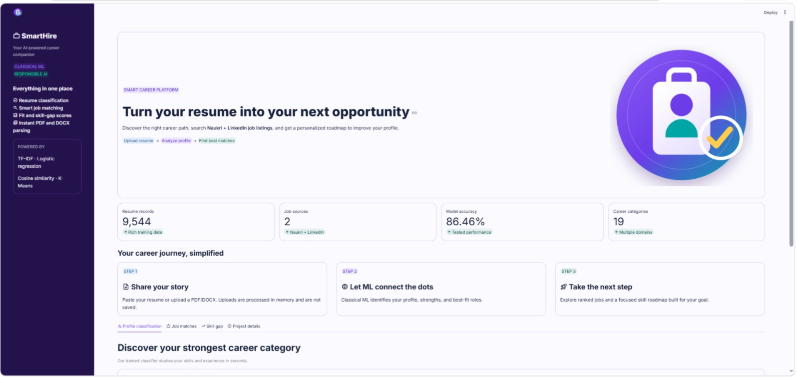
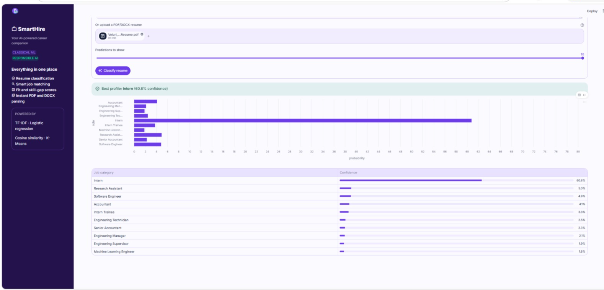
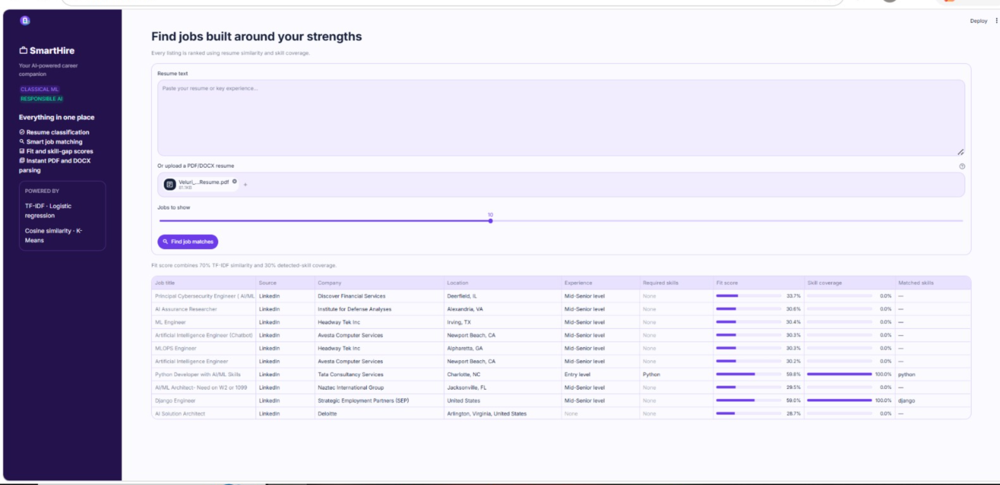
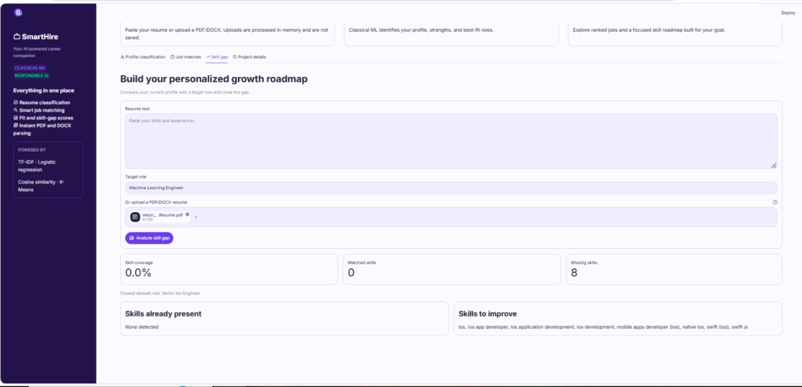
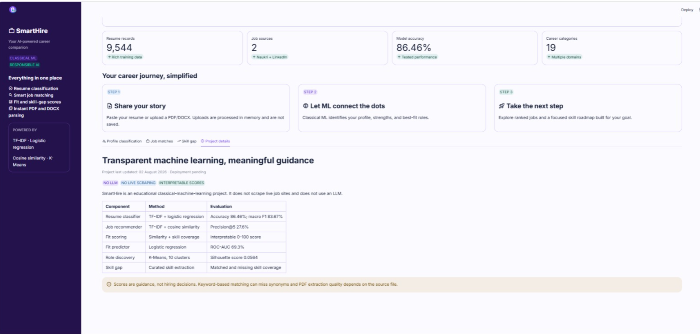

# SmartHire

**Last updated:** 02 August 2026

**Project status:** Internship submission ready

SmartHire is a classical machine-learning portal that classifies resumes,
recommends jobs, calculates an interpretable fit score, and reports skill gaps.
It uses no live scraping, LLM, or generative AI.

## Application preview

### SmartHire dashboard



### Resume classification



### Ranked job matches



### Skill-gap roadmap



### Transparent project details



## Results

| Component | Result |
|---|---:|
| Resume classification accuracy | 86.46% |
| Macro F1-score | 83.67% |
| Resume records | 9,544 |
| Processed Naukri + LinkedIn jobs | 67,790 |
| Predicted categories | 19 |
| Recommender Precision@5 | 0.276 |
| Fit predictor ROC-AUC | 0.693 |

The classifier uses TF-IDF and logistic regression. Job recommendations use
TF-IDF cosine similarity over the merged Naukri and LinkedIn corpus. Fit scores combine
70% text similarity and 30% detected-skill coverage. K-Means provides
unsupervised role discovery, while keyword extraction powers the skill-gap
report.

## Setup and run

```powershell
python -m venv venv
venv\Scripts\activate
pip install -r requirements.txt
streamlit run app/streamlit_app.py
```

Open `http://localhost:8501`. The app accepts pasted resume text, PDF files,
and DOCX files. Uploads are validated, processed in memory, and are not stored.

## Privacy and responsible use

- Uploaded resumes are not written to disk or a database.
- PDF and DOCX uploads are limited to 10 MB and validated server-side.
- Pasted text is limited to 100,000 characters.
- Results provide career guidance and must not be used as automated hiring decisions.
- SmartHire does not scrape live job sites and does not use generative AI.

Rebuild the combined Naukri + LinkedIn search index after changing datasets:

```powershell
python -m src.data.load_data
```

Build the compact GitHub/Streamlit deployment index:

```powershell
python -m src.data.load_data --build-deploy-index
```

Run the automated tests:

```powershell
python -m pytest tests -v
```

## Repository structure

```text
SmartHire/
├── README.md
├── requirements.txt
├── .gitignore
├── data/
│   ├── raw/
│   ├── interim/
│   └── processed/
├── notebooks/
│   ├── 01_eda.ipynb
│   ├── 02_resume_classifier.ipynb
│   ├── 03_recommender.ipynb
│   ├── 04_clustering_topics.ipynb
│   └── 05_fit_predictor.ipynb
├── src/
│   ├── __init__.py
│   ├── config.py
│   ├── evaluate.py
│   ├── data/
│   │   ├── load_data.py
│   │   └── preprocess.py
│   ├── features/
│   │   ├── text_features.py
│   │   └── match_features.py
│   ├── models/
│   │   ├── classifier.py
│   │   ├── recommender.py
│   │   ├── clustering.py
│   │   └── fit_predictor.py
│   └── parsing/
│       └── resume_parser.py
├── models/
├── app/
│   └── streamlit_app.py
├── reports/
│   ├── figures/
│   └── final_report.pdf
└── tests/
```

## Reproduce the analysis

Run notebooks in numeric order:

1. `01_eda.ipynb`
2. `02_resume_classifier.ipynb`
3. `03_recommender.ipynb`
4. `04_clustering_topics.ipynb`
5. `05_fit_predictor.ipynb`

Detailed model metrics and limitations are in
`reports/evaluation_report.txt` and `reports/final_report.pdf`.

## Current scope

The internship deliverables are complete locally. Online deployment and a
future consent-based admin/database workflow are intentionally outside the
current release scope.

## Limitations and responsible use

SmartHire is an educational career-guidance prototype, not an automated hiring
decision system. TF-IDF does not fully understand context or synonyms, the
skill extractor uses a curated vocabulary, and scanned PDFs may need OCR.
Recommendations are limited to the supplied public datasets.
